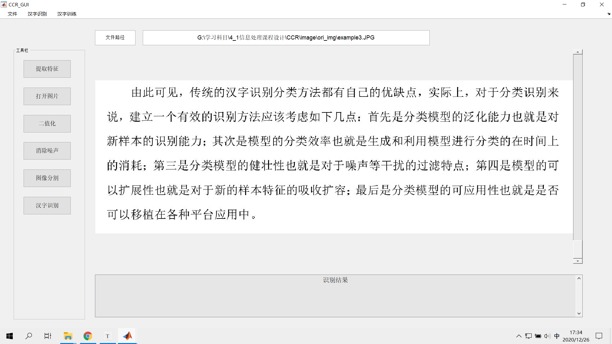
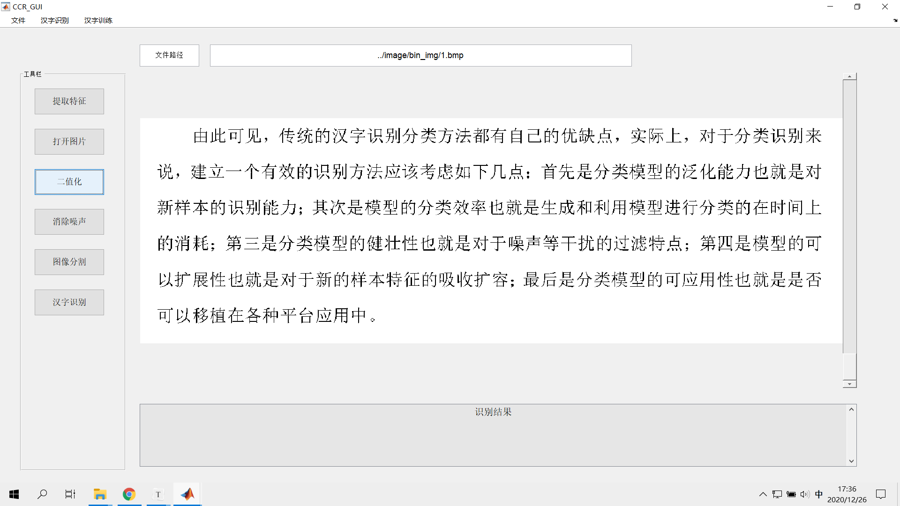
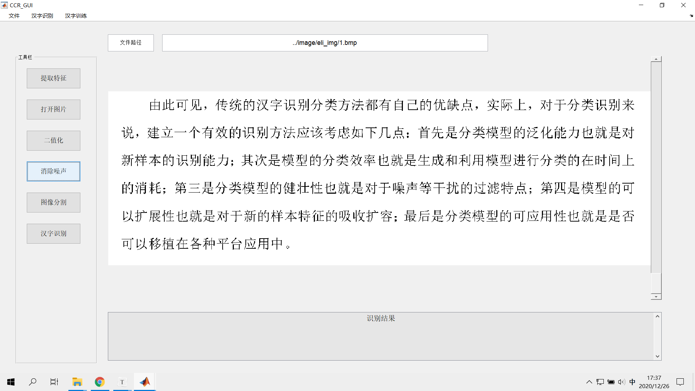
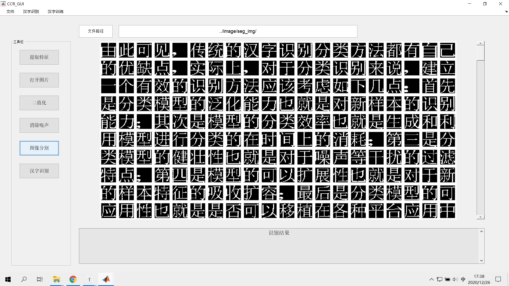
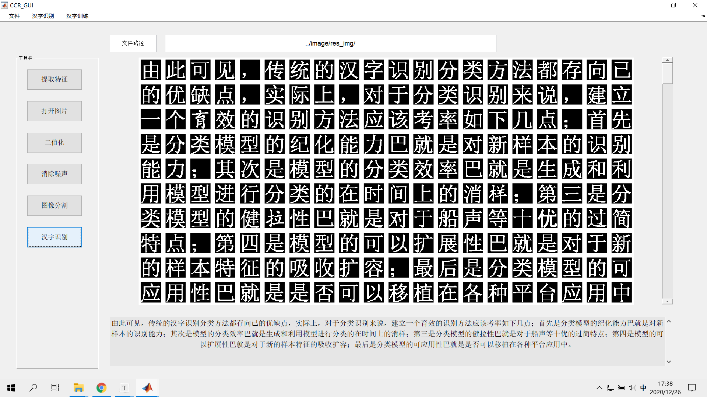

# CCR
##### 印刷汉字识别系统：
* v0.0：采用固定汉字宽度分割图片行中的汉字和相同方法训练。
* v1.0：采用动态汉字宽度分割图片行中的汉字和相同方法训练。
* v2.0：添加了GUI和打包了软件，通过解压“CCR应用程序”压缩包，直接运行 '/for_redistribution_files_only/'下的GUI.exe，即可运行程序。

##### 运行过程：

（1）打开图片

（2）二值化

（3）消除噪声

（4）图像分割

（5）汉字识别

